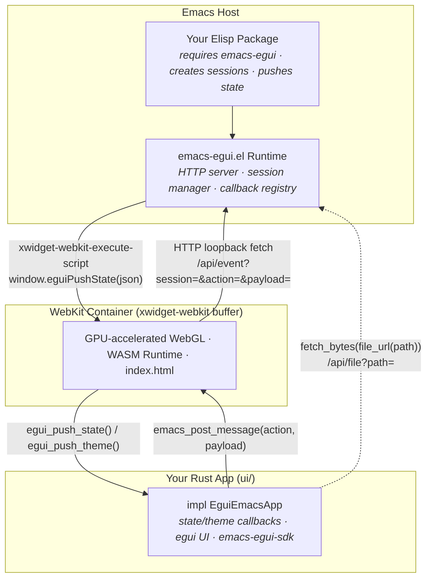

# emacs-egui

[](https://www.rust-lang.org/)
[](https://webassembly.org/)
[](https://www.gnu.org/software/emacs/)
[](LICENSE)

A framework for building GPU-accelerated [egui](https://github.com/emilk/egui) applications compiled to WebAssembly that run inside Emacs via xwidget-webkit.

**emacs-egui is not an Emacs package you install and use directly.** It is an SDK and runtime that app developers use to build their own Emacs-integrated tools. End users install the apps built on top of it.

## Apps built with emacs-egui

| App | Description |
|-----|-------------|
| [emacs-parquet-explorer](https://github.com/nohzafk/emacs-parquet-explorer) | GPU-accelerated Parquet file viewer with virtual scrolling, search, filtering, and CSV export |

---

## How It Works

emacs-egui provides two components:

1. **Rust SDK** (`sdk/`) -- a crate your WASM app depends on. It provides the `EguiEmacsApp` trait, automatic Emacs theme syncing, and bidirectional IPC between your app and Emacs Lisp.

2. **Elisp runtime** (`lisp/emacs-egui.el`) -- a library that consumer apps `require` in their own Elisp layer. It manages xwidget sessions, a local HTTP asset server, and event dispatch.



**IPC channels:**

- **Emacs -> WASM:** Elisp calls `window.eguiPushState(json)` / `window.eguiPushTheme(json)` via `xwidget-webkit-execute-script`. The SDK queues these and drains them on the next egui frame.
- **WASM -> Emacs:** `emacs_post_message(action, payload)` sends a non-blocking `fetch()` to the Elisp HTTP server at `http://127.0.0.1:<port>/api/event`. As a fallback, it also sets `document.title` for the `xwidget-webkit-title-change-hook`.
- **File access:** WASM apps fetch local files via `fetch_bytes(file_url(path))`, which hits the Elisp server's `/api/file` gateway to stream raw bytes into the WASM sandbox.
- **Theme:** Emacs face colors are embedded in the URL fragment at boot (zero-flash), and pushed live via `eguiPushTheme` on theme changes.

---

## Prerequisites

1. **Emacs 29.1+** with xwidget support

   ```sh
   # macOS (Homebrew)
   brew install emacs-plus@29 --with-xwidgets

   # Linux (from source)
   ./configure --with-xwidgets
   ```

2. **Rust + wasm-pack**

   ```sh
   curl --proto ‘=https’ --tlsv1.2 -sSf https://sh.rustup.rs | sh
   cargo install wasm-pack
   ```

---

## Building an App

This walkthrough creates a minimal app called `my-emacs-app`.

Consumer apps include `emacs-egui` as a **git submodule**. This bundles both the Rust SDK (for compilation) and the Elisp runtime (for Emacs) -- users only need to clone your repo.

An emacs-egui app has two layers:

- **`ui/`** -- the Rust WASM crate that defines your app's interface. It contains the Rust source, the `index.html` host page, and the compiled `pkg/` output.
- **`lisp/`** -- the Elisp integration that launches the UI, pushes state, and handles callbacks.

```text
my-emacs-app/
├── emacs-egui/              # git submodule
├── ui/                      # Rust WASM crate (the UI layer)
│   ├── Cargo.toml
│   ├── src/
│   │   └── lib.rs           # impl EguiEmacsApp
│   ├── index.html           # HTML host page for the WASM bundle
│   └── pkg/                 # wasm-pack output (committed for users)
└── lisp/                    # Elisp integration layer
    └── my-emacs-app.el
```

### Step 1: Create the project and add the submodule

```sh
mkdir my-emacs-app && cd my-emacs-app
git init
git submodule add https://github.com/nohzafk/emacs-egui.git emacs-egui
cargo new --lib ui
```

Set up `ui/Cargo.toml`:

```toml
[package]
name = "my-emacs-app"
version = "0.1.0"
edition = "2021"

[lib]
crate-type = ["cdylib", "rlib"]

[dependencies]
emacs-egui-sdk = { path = "../emacs-egui/sdk" }
serde = { version = "1.0", features = ["derive"] }
serde_json = "1.0"
wasm-bindgen = "0.2"
egui = "0.29"
eframe = { version = "0.29", default-features = false, features = ["glow"] }
```

> `wasm-bindgen` is required for the `#[wasm_bindgen]` proc macro. Other WASM deps (`js-sys`, `web-sys`, `wasm-bindgen-futures`, `console_error_panic_hook`) are provided by the SDK and don’t need to be listed.

### Step 2: Implement your app

Replace `ui/src/lib.rs`:

```rust
use serde::Deserialize;
use wasm_bindgen::prelude::*;
use emacs_egui_sdk::{EguiEmacsApp, ThemeColors};

/// The state type that Emacs will push as JSON.
#[derive(Deserialize, Debug)]
pub struct AppState {
    pub username: String,
    pub counter: i32,
}

pub struct MyApp {
    username: String,
    click_count: i32,
}

impl MyApp {
    pub fn new() -> Self {
        Self {
            username: "Guest".to_string(),
            click_count: 0,
        }
    }
}

impl EguiEmacsApp for MyApp {
    type State = AppState;

    fn on_state_update(&mut self, state: Self::State) {
        self.username = state.username;
        self.click_count = state.counter;
    }

    fn on_theme_update(&mut self, _theme: ThemeColors) {
        // Theme visuals are applied automatically by the SDK.
        // Use this hook if you need custom color logic beyond the defaults.
    }

    fn update(&mut self, ctx: &egui::Context, _frame: &mut eframe::Frame) {
        egui::CentralPanel::default().show(ctx, |ui| {
            ui.heading("Hello from emacs-egui!");
            ui.separator();
            ui.label(format!("User: {}", self.username));
            ui.label(format!("Count: {}", self.click_count));

            if ui.button("Increment").clicked() {
                self.click_count += 1;
                // Send event back to Emacs
                emacs_egui_sdk::emacs_post_message(
                    "incremented",
                    serde_json::json!({ "new_count": self.click_count }),
                );
            }
        });
    }
}

#[cfg(target_arch = "wasm32")]
#[wasm_bindgen]
pub fn start_app(canvas_id: &str) -> Result<(), JsValue> {
    emacs_egui_sdk::launch_simple(canvas_id, MyApp::new())
}
```

### Step 3: Create the HTML host

Create `ui/index.html`:

```html
<!DOCTYPE html>
<html lang="en">
<head>
    <meta charset="utf-8">
    <title>my-emacs-app</title>
    <style>
        html, body {
            margin: 0; padding: 0;
            width: 100%; height: 100%;
            overflow: hidden;
            background-color: transparent;
        }
        canvas {
            width: 100%; height: 100%;
            display: block;
            background-color: transparent;
            opacity: 0;
            transition: opacity 80ms ease-out;
        }
        canvas.ready { opacity: 1; }
    </style>
</head>
<body>
    <canvas id="egui-canvas"></canvas>
    <script type="module">
        import init, { start_app, egui_push_state, egui_push_theme }
            from "./pkg/my_emacs_app.js";

        function parseHashParams() {
            const hash = window.location.hash.replace(/^#/, "");
            if (!hash) return null;
            const p = new URLSearchParams(hash);
            return {
                bg: p.get("bg"), fg: p.get("fg"),
                fontSize: p.get("font-size") ? Number(p.get("font-size")) : null,
                surfaceBg: p.get("surface-bg") || null,
            };
        }

        async function run() {
            const canvas = document.getElementById("egui-canvas");
            await init();
            await start_app("egui-canvas");

            // Inject initial theme from URL hash to prevent flash
            const params = parseHashParams();
            if (params && params.bg && params.fg) {
                egui_push_theme(JSON.stringify({
                    bg: params.bg, fg: params.fg,
                    "font-size": params.fontSize,
                    "surface-bg": params.surfaceBg,
                }));
            }

            requestAnimationFrame(() => canvas.classList.add("ready"));

            // Expose IPC bindings for the Elisp runtime
            window.eguiPushState = (json) => { egui_push_state(json); };
            window.eguiPushTheme = (json) => { egui_push_theme(json); };
        }

        run();
    </script>
</body>
</html>
```

### Step 4: Build

```sh
wasm-pack build --target web --release --out-dir ui/pkg
```

### Step 5: Write the Elisp integration

Create `lisp/my-emacs-app.el`:

```elisp
(eval-and-compile
  (defvar my-emacs-app--dir
    (file-name-directory (or load-file-name
                             (bound-and-true-p byte-compile-current-file)
                             buffer-file-name
                             default-directory))
    "Directory containing my-emacs-app lisp files.")

  ;; Auto-load bundled emacs-egui from the submodule
  (unless (featurep 'emacs-egui)
    (add-to-list 'load-path
                 (expand-file-name "../emacs-egui/lisp/" my-emacs-app--dir)))
  (require 'emacs-egui))

;; Version gate
(when (version< emacs-egui-version "0.1.0")
  (error "my-emacs-app requires emacs-egui >= 0.1.0, found %s" emacs-egui-version))

;; Register renderer directory
(emacs-egui-register-app "my-emacs-app"
                         (expand-file-name "../ui/" my-emacs-app--dir))

(defun my-emacs-app-open ()
  "Launch My App."
  (interactive)
  (let ((session (emacs-egui-create-buffer
                  :app-name "my-emacs-app"
                  :buffer-name "*My App*")))

    ;; Handle events from the WASM app
    (emacs-egui-on session "incremented"
                   (lambda (payload)
                     (message "Count is now: %d"
                              (emacs-egui-get-field payload 'new_count))))

    (switch-to-buffer (plist-get session :buffer))

    ;; Push initial state after WASM boots
    (run-with-timer 0.6 nil
                    (lambda ()
                      (emacs-egui-send-state
                       session '((username . "World")
                                 (counter . 0)))))))
```

Users only need one `load-path` entry — the bundled submodule is discovered automatically:
```elisp
(add-to-list 'load-path "/path/to/my-emacs-app/lisp")
```

---

## SDK API Reference

### Rust (`emacs-egui-sdk`)

**Trait: `EguiEmacsApp`**

```rust
pub trait EguiEmacsApp {
    type State: serde::de::DeserializeOwned;
    fn on_state_update(&mut self, state: Self::State);
    fn on_theme_update(&mut self, theme: ThemeColors);
    fn update(&mut self, ctx: &egui::Context, frame: &mut eframe::Frame);
}
```

| Function | Description |
|----------|-------------|
| `launch_simple(canvas_id, app)` | One-line entry point: initializes eframe and starts the render loop. Use from your `#[wasm_bindgen] start_app`. |
| `launch(canvas_id, \|params\| App::new(params))` | Entry point that passes `SessionParams` (session ID + port) to your app constructor. |
| `bootstrap_app(app, canvas_id)` | Lower-level: starts the render loop without parsing URL params. Use `launch_simple` or `launch` instead. |
| `emacs_post_message(action, payload)` | Send a named event with a JSON-serializable payload back to Emacs. |
| `file_url(path)` | Build a URL to fetch a local file through the Elisp server's `/api/file` gateway. |
| `fetch_bytes(url)` | `async` helper to fetch raw bytes from a URL. Use with `file_url()`. |
| `parse_session_params()` | Parse `SessionParams` (session ID + port) from the URL hash fragment. |
| `egui_push_state(json)` | (JS-callable) Push a state JSON string into the queue. Called by the Elisp runtime, not by your Rust code. |
| `egui_push_theme(json)` | (JS-callable) Push a theme update. Called by the Elisp runtime. |

**Struct: `ThemeColors`**

| Field | Type | Description |
|-------|------|-------------|
| `bg` | `String` | Background hex color from Emacs face |
| `fg` | `String` | Foreground hex color from Emacs face |
| `font_size` | `Option<f32>` | Font size from Emacs (auto-scaled by SDK) |
| `surface_bg` | `String` | Panel/surface background color |

### Elisp (`emacs-egui.el`)

| Function | Description |
|----------|-------------|
| `(emacs-egui-register-app NAME UI-DIR)` | Register an app's UI directory. Call at load time so the framework can find your assets. |
| `(emacs-egui-create-buffer :app-name NAME :buffer-name BUF)` | Create an xwidget session. Returns a session plist with `:id`, `:buffer`, `:xwidget`. |
| `(emacs-egui-on SESSION ACTION CALLBACK)` | Register a callback for events sent by `emacs_post_message` from the WASM app. |
| `(emacs-egui-send-state SESSION ALIST)` | Push a state alist/plist as JSON to the WASM app. |
| `(emacs-egui-send-theme SESSION)` | Re-sync current Emacs theme colors to the WASM app. |
| `(emacs-egui-get-field PAYLOAD KEY)` | Extract a field from an IPC callback payload (handles both alist and plist formats). |
| `(emacs-egui-ensure-server)` | Start the loopback HTTP server (called automatically by `create-buffer`). |
| `(emacs-egui-shutdown)` | Kill the HTTP server and clear all sessions. |

---

## Distribution Model

Consumer apps include `emacs-egui` as a **git submodule** at the repository root. This bundles everything -- the Rust SDK (for `wasm-pack` compilation) and the Elisp runtime (for Emacs) -- so users only clone one repo.

```text
my-app/
├── emacs-egui/                  # git submodule
│   ├── sdk/                     # Rust SDK (path dep in Cargo.toml)
│   └── lisp/
│       └── emacs-egui.el        # Elisp runtime (auto-loaded by consumer)
├── ui/
│   ├── Cargo.toml               # depends on ../emacs-egui/sdk
│   ├── src/lib.rs
│   ├── index.html
│   └── pkg/                     # pre-built WASM (committed)
└── lisp/
    └── my-app.el                # auto-loads emacs-egui from submodule
```

**For users:** clone with `--recurse-submodules`, add `lisp/` to `load-path`. One entry.

**For developers:** `git submodule update --remote emacs-egui` pulls framework updates.

**Multiple apps:** `(require 'emacs-egui)` is idempotent -- whichever app loads first provides it. Use `emacs-egui-version` to gate on minimum version.

### Packaging and Autoloading (The Dependency Caveat)

Because standard Emacs package managers (like `package.el`, Straight, or Elpaca) automatically activate packages by looking up their declared dependencies in public archives (e.g., `Package-Requires: ((emacs-egui "0.1.0"))`), local development checkouts that bundle `emacs-egui` as a Git submodule require special care:

1. **Standard Activation Failures:** If `emacs-egui` is not published to public archives (like ELPA/MELPA), standard package activation will fail to satisfy the dependency and skip activating your package. This means your package's `;;;###autoload` cookies will **not** be registered at Emacs boot.
2. **Recommended Configuration Pattern:** To support direct Git clones and local development configurations (like Doom Emacs or Emacs Hypervisor), instruct your users to bypass the package manager's activation pipeline by manually adding the `lisp/` folder to the `load-path` and loading the autoloads file:
   ```elisp
   (let ((dir (expand-file-name "~/projects/my-emacs-app/lisp")))
     (when (file-directory-p dir)
       (add-to-list 'load-path dir)
       (load "my-emacs-app-autoloads" nil t)
       (keymap-set global-map "C-c m a" #'my-emacs-app-open)))
   ```
   This pattern guarantees:
   - Your package remains fully **lazy-loaded** (boosting startup performance).
   - The robust `eval-and-compile` submodule block in your main `.el` file successfully resolves the nested Git submodule dependency at runtime.
   - It completely bypasses built-in package manager dependency lookup issues.

---

## License

MIT
